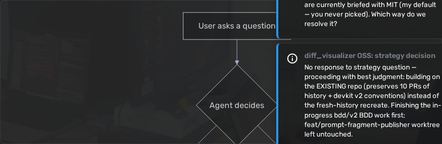
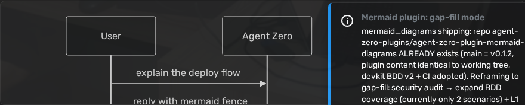
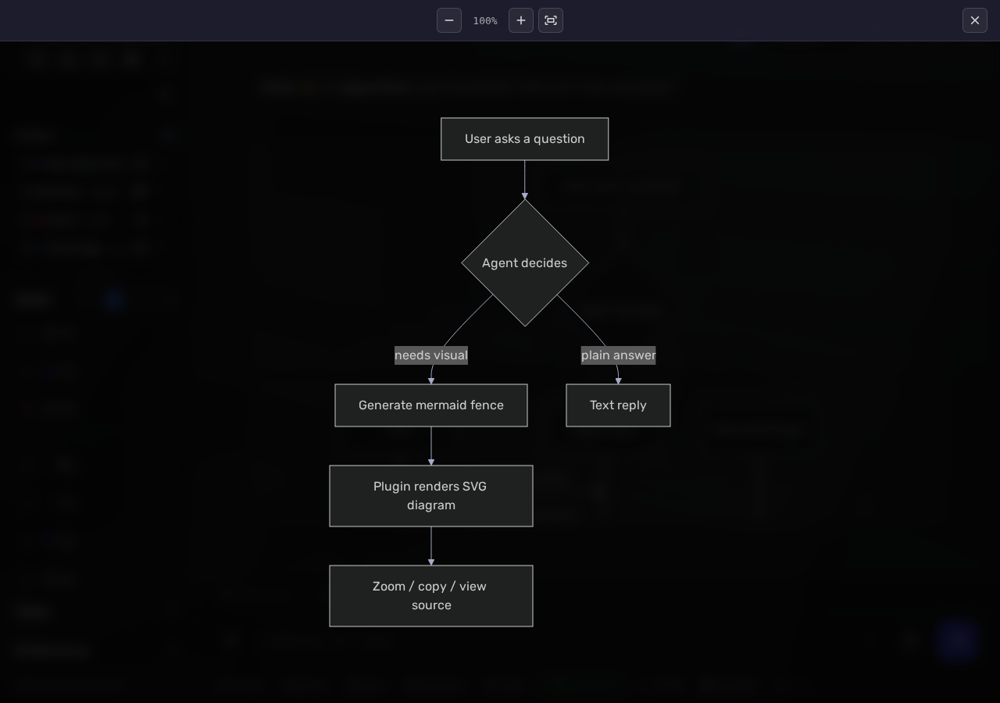
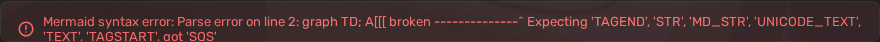
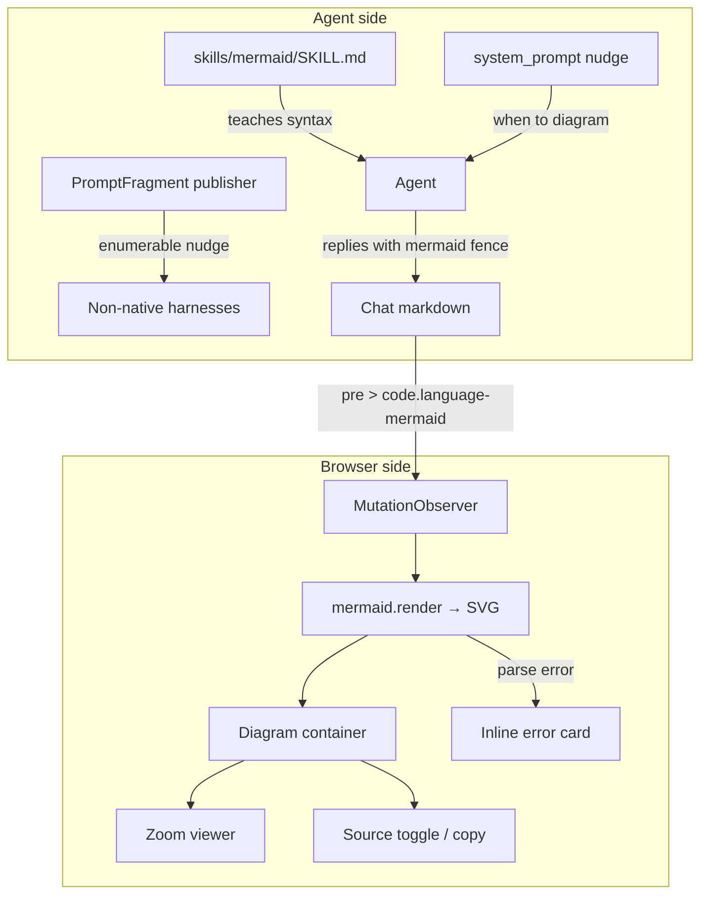

# Mermaid Diagrams — Agent Zero Plugin

Turn fenced ` ```mermaid ` code blocks in your Agent Zero chats into **interactive SVG diagrams** — with zoom, pan, source view, and one-click copy. The plugin also teaches your agent *when* and *how* to reach for a diagram: it bundles a Mermaid syntax skill and injects a behavioral nudge so the agent visualizes architectures, flows, and state machines instead of describing them in prose.

| Rendered flowchart | Sequence diagram |
|---|---|
|  |  |

## Features

- **Live rendering** — a MutationObserver watches the chat DOM and replaces every ` ```mermaid ` block with a rendered SVG the moment it appears. All mermaid@11 diagram types: flowcharts, sequence, state, class, ER, mindmaps, timelines, …
- **Zoom viewer** — click any diagram (or its zoom button) for a full-screen viewer with wheel zoom-to-pointer, drag panning, zoom in/out/reset buttons, and Esc to close.

  

- **Source actions** — hover a diagram for the toolbar: toggle the original Mermaid source, or copy it to the clipboard.
- **Graceful errors** — invalid Mermaid never breaks the chat; you get an inline error card with the offending source:

  

- **Agent guidance** — the bundled `mermaid` skill teaches syntax; a system-prompt nudge steers the agent to diagram architectures/flows on "show me / visualize / draw" cues; the same nudge is published as an enumerable PromptFragment for non-native harnesses (e.g. the Claude bridge).

## How it works



The renderer ships as a `sidebar-end` webui extension (`mermaid-renderer.html`) and loads mermaid@11 from the jsDelivr CDN at page load. No server-side components: no API handlers, no tools, no hooks, no configuration state.

## Installation

### Plugin Hub

Once listed in the [Plugin Index](https://github.com/agent0ai/a0-plugins): open **Settings → Plugins**, find **Mermaid Diagrams**, click **Install**.

### Manual (zip)

1. Build the zip (or grab one from a [release](../../releases)):
   ```bash
   make package        # → dist/mermaid_diagrams.zip
   ```
2. In Agent Zero: **Settings → Plugins → Install from file** → pick the zip.
3. New chats pick the renderer up immediately; hard-refresh open tabs.

> **Note:** rendering needs browser access to `cdn.jsdelivr.net` (mermaid@11 ESM). In offline environments diagrams stay as plain code blocks — nothing breaks.

## Configuration

None. The plugin has no settings (`default_config.yaml` is intentionally empty), no per-project or per-agent state. Disable/uninstall from the Plugins panel reverts the chat to plain code blocks.

## Development

```bash
git clone --recurse-submodules https://github.com/agent-zero-plugins/agent-zero-plugin-mermaid-diagrams
cd agent-zero-plugin-mermaid-diagrams

make verify          # BDD static gates: feature-purity, honesty, traceability
python -m pytest tests -q    # unit + L1 shape suite (needs tests/_testkit submodule)
make e2e             # full behaviour BDD run on a nested disposable A0 (podman)
```

### Test layout

| Layer | Where | What |
|---|---|---|
| L1 shape | `tests/test_plugin_shape.py` | testkit static validator, deps/A0-API audits, dead hooks, thumbnail |
| Unit seams | `tests/test_mermaid_nudge.py`, `tests/test_publish_nudge.py`, `tests/test_skill_contract.py` | prompt nudge, fragment publisher, skill front-matter |
| Behaviour BDD | `tests/e2e/features/*.feature` + `steps/` | rendering (all types, errors, negatives) + zoom/toggle/copy, run against a live A0 |

Specs live in `docs/spec/` (behaviour-spec → e2e.feature → steps-spec → implementation-plan). CI (`unit` + `plugin-e2e`) runs the whole pyramid including a seam-off red-proof — a scenario that passes without the plugin installed fails the build.

## License

Apache-2.0 — see [LICENSE](LICENSE).
