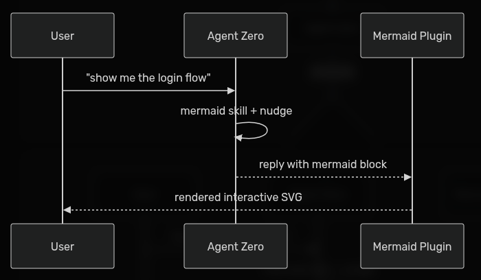
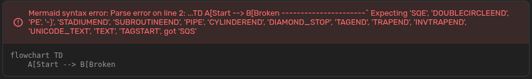
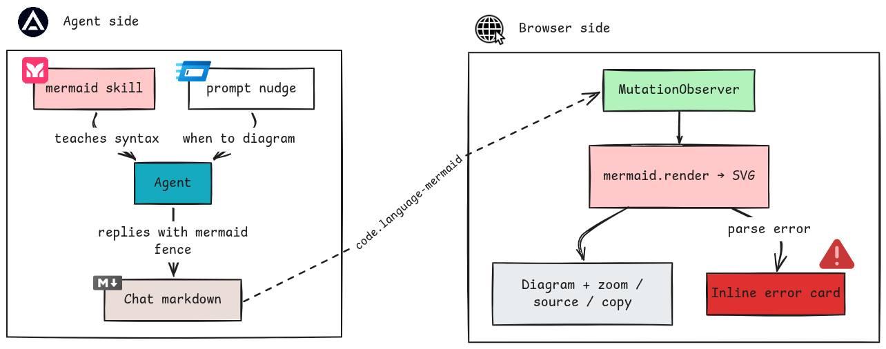

# Mermaid Diagrams — Agent Zero Plugin

<!-- BADGES:START (generated by the devkit — `make badges`) -->

[](https://github.com/agent-zero-plugins/agent-zero-plugin-mermaid-diagrams/actions/workflows/plugin-e2e.yml) [](https://github.com/agent-zero-plugins/agent-zero-plugin-mermaid-diagrams/tree/main/tests/e2e/features) [](https://github.com/agent-zero-plugins/agent-zero-plugin-mermaid-diagrams/tags) [](https://github.com/agent-zero-plugins/agent-zero-plugin-mermaid-diagrams/blob/main/LICENSE) [](https://github.com/agent-zero-plugins/agent-zero-plugin-mermaid-diagrams/blob/main/CONTRIBUTING.md)

<!-- BADGES:END -->

Turns ` ```mermaid ` code blocks in Agent Zero chats into **interactive SVG diagrams** — with zoom, pan, source view, and one-click copy. It also nudges the agent to _draw_ instead of describe: a bundled Mermaid skill plus a system-prompt hint make diagrams show up when you ask to visualize something.

A sequence diagram, rendered live in the chat:



## ✨ Features

- **Live rendering** : a MutationObserver watches the chat DOM and replaces every ` ```mermaid` block with a rendered SVG the moment it appears. All mermaid@11 diagram types: flowcharts, sequence, state, class, ER, mindmaps, timelines, …
- **Zoom viewer** : click a diagram for full-screen view: wheel zoom, drag pan, reset, Esc to close.
  
- **Source actions** : hover for the toolbar: show/hide the original Mermaid source, or copy it to clipboard.
- **Graceful errors** : invalid Mermaid shows an inline error card with the source; the chat keeps working.
  
- **Agent guidance** : the bundled skill teaches syntax; a prompt nudge steers the agent toward diagrams on "show me / visualize / draw" cues (published as a PromptFragment for non-native harnesses too).

## ⚙️ How it works



A `sidebar-end` webui extension, pinned to `mermaid 11.16.1` from the jsDelivr CDN. No server-side components — no API handlers, no tools, no config.

## 💬 Usage

Nothing to drive. Any ` ```mermaid ` block the agent sends is rendered automatically; flowchart, sequence, and state diagrams each have an asserted [BDD scenario](tests/e2e/features/), and [`docs/BEHAVIOUR.md`](docs/BEHAVIOUR.md) shows each as a screenshot from a passing run. Non-mermaid code blocks are left untouched.

---

## 📦 Installation

**Plugin Hub** — once listed in the [Plugin Index](https://github.com/agent0ai/a0-plugins): **Settings → Plugins → Mermaid Diagrams → Install**.

**Manual** (Zip) — build it yourself, or grab the zip from the [latest release](https://github.com/agent-zero-plugins/agent-zero-plugin-mermaid-diagrams/releases/latest):

```bash
make package        # → dist/mermaid_diagrams.zip
```

Then **Settings → Plugins → Install from file** → pick the zip. New chats pick it up immediately; hard-refresh open tabs.

> **Note**: rendering needs browser access to `cdn.jsdelivr.net` (pinned mermaid 11.16.1, loaded from the CDN). In offline environments diagrams stay as plain code blocks — nothing breaks.

## 🔧 Configuration

None. The plugin has no settings (`default_config.yaml` is intentionally empty), no per-project or per-agent state. Disable/uninstall from the Plugins panel reverts the chat to plain code blocks.

## 🛠️ Development

```bash
git clone --recurse-submodules https://github.com/agent-zero-plugins/agent-zero-plugin-mermaid-diagrams
cd agent-zero-plugin-mermaid-diagrams

make verify                  # BDD static gates
python -m pytest tests -q    # unit + L1 shape suite (needs tests/_testkit submodule)
make e2e                     # full behaviour BDD run on a nested disposable A0 (podman)
```

## 🧪 Test layout

| Layer         | Where                              | What                                                                       |
| ------------- | ---------------------------------- | -------------------------------------------------------------------------- |
| L1 shape      | `tests/test_plugin_shape.py`       | static validator, deps/A0-API audits, dead hooks                           |
| Unit seams    | `tests/test_mermaid_nudge.py` etc. | prompt nudge, fragment publisher, skill front-matter                       |
| Behaviour BDD | `tests/e2e/features/` + `steps/`   | rendering (types, errors, negatives) + zoom/toggle/copy, against a live A0 |

Specs live in `docs/spec/`. CI runs the whole pyramid including a seam-off red-proof — a scenario that passes without the plugin fails the build.

## ⚖️ License

Apache-2.0 — see [LICENSE](LICENSE).
