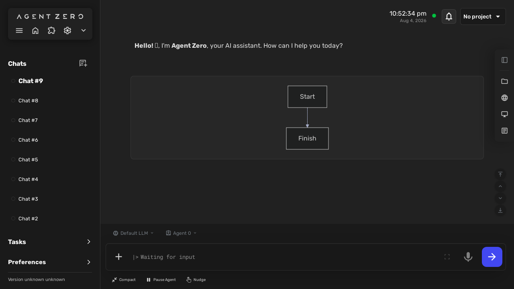
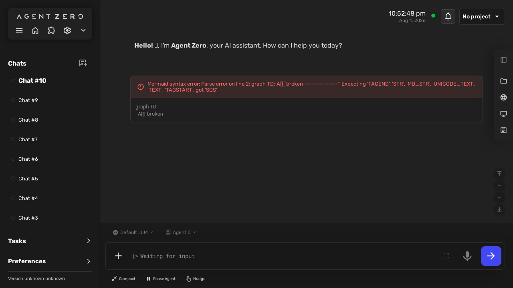
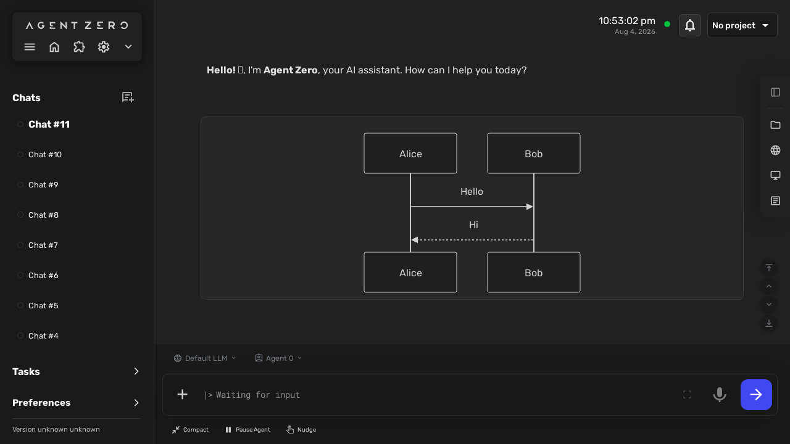
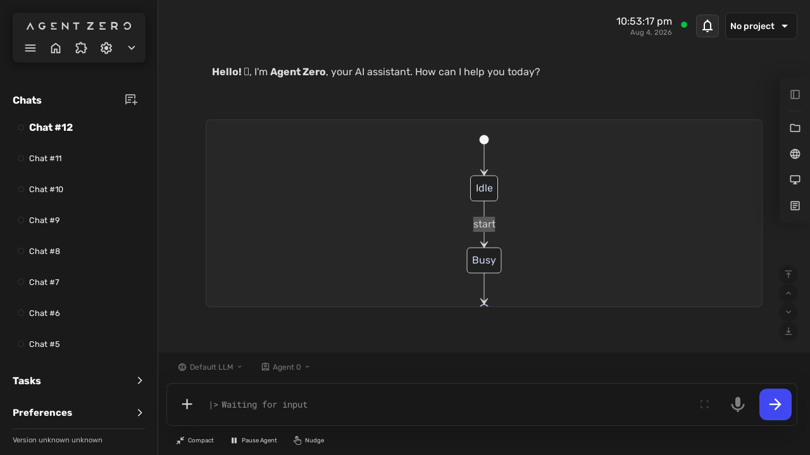
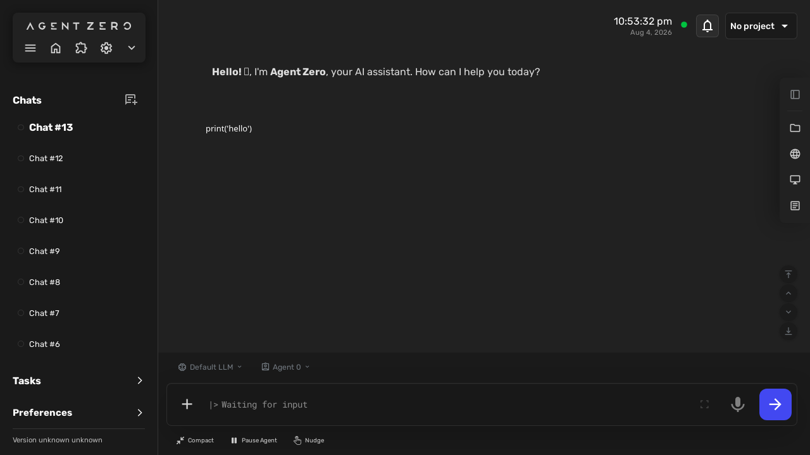
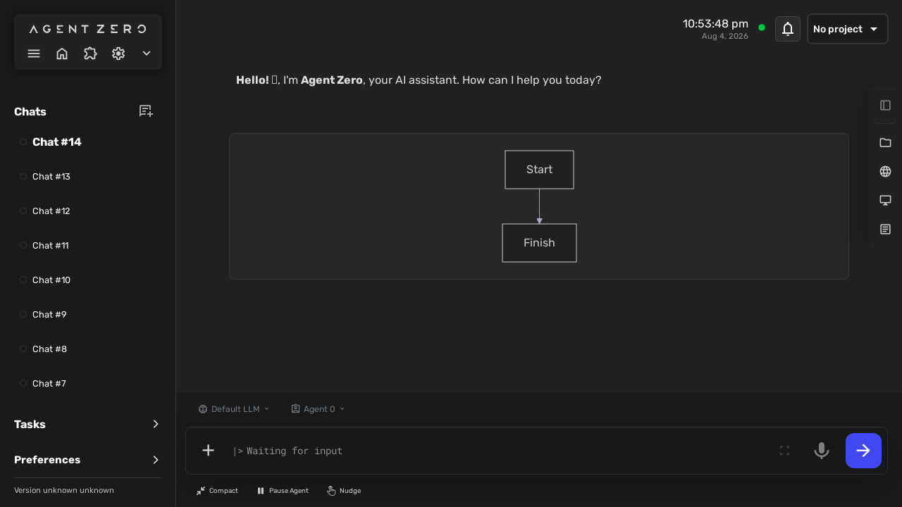
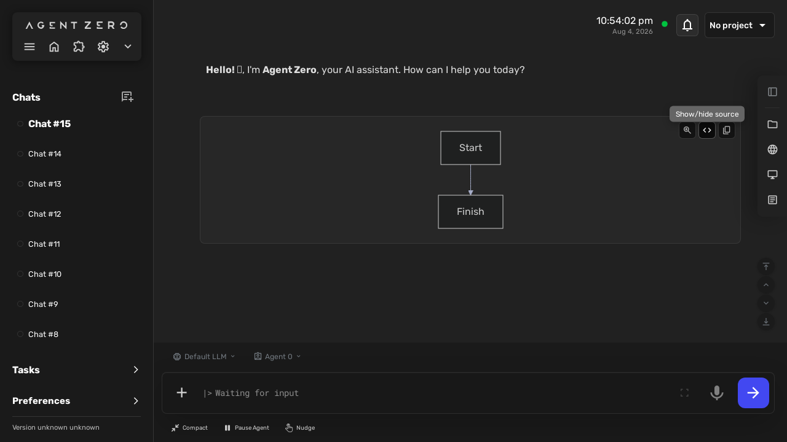
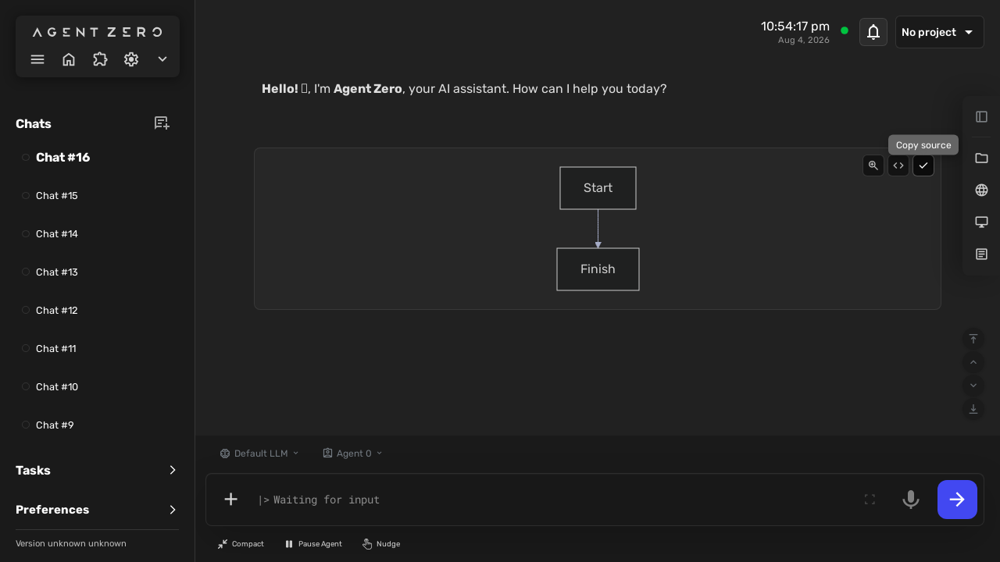

# Mermaid Diagrams — behaviour

<!-- GENERATED by the devkit (`make docs`) from this plugin's own e2e run.
     Do not edit by hand: every screenshot below is the asserted end state of a
     passing BDD scenario, so it cannot show behaviour the plugin no longer has.
     Captions are the scenario titles verbatim — reword them in tests/e2e/features/. -->

Each section is one scenario from `tests/e2e/features/`, with the screenshot the
test captured at its final assertion. 8 of 8 scenarios have one.

## Rendering mermaid diagrams

### A mermaid diagram in the chat is rendered
BEH-1

### An invalid diagram shows an error, not a crash
BEH-2

### A sequence diagram is rendered
BEH-6

### A state diagram is rendered
BEH-6

### Non-mermaid code blocks are left alone
BEH-7

## Interacting with a rendered diagram

### The diagram opens in a zoom viewer and can be zoomed and closed
BEH-3

### The diagram source can be shown and hidden
BEH-4

### The diagram source can be copied
BEH-5

