# Mermaid Diagrams Skill

Create diagrams using Mermaid syntax in fenced code blocks. The chat UI automatically renders them as interactive SVGs.

## Output Format

Always wrap Mermaid code in a fenced code block with the `mermaid` language identifier:

````
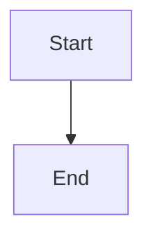
````

## Diagram Type Selection Guide

| User wants to understand... | Use this diagram type |
|---|---|
| A process, workflow, or decision tree | **Flowchart** |
| How components interact over time | **Sequence Diagram** |
| Object/class structure and relationships | **Class Diagram** |
| States and transitions of a system | **State Diagram** |
| Database tables and relationships | **ER Diagram** |
| Project schedule and timeline | **Gantt Chart** |
| Proportions or distribution | **Pie Chart** |
| Brainstorming or topic hierarchy | **Mindmap** |
| Chronological events | **Timeline** |
| Git branching strategy | **Git Graph** |

## Syntax Reference

### Flowchart

Use for processes, workflows, algorithms, decision trees.

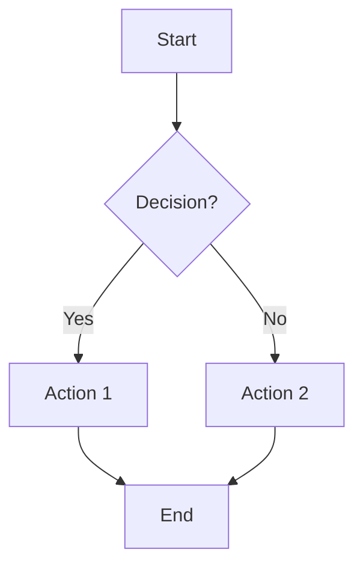

Node shapes:
- `[text]` — rectangle
- `(text)` — rounded rectangle
- `{text}` — diamond (decision)
- `([text])` — stadium/pill
- `[[text]]` — subroutine
- `[(text)]` — cylinder (database)
- `((text))` — circle
- `>text]` — flag/asymmetric

Directions: `TD` (top-down), `LR` (left-right), `BT` (bottom-top), `RL` (right-left)

Edge styles:
- `-->` solid arrow
- `-.->` dotted arrow
- `==>` thick arrow
- `-->|label|` labeled arrow
- `---` solid line (no arrow)

Subgraphs:
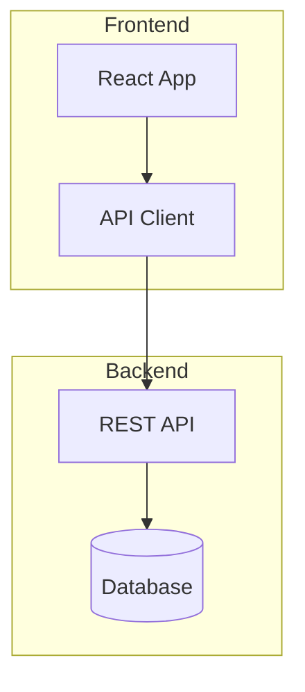

### Sequence Diagram

Use for API interactions, service communication, protocol flows.

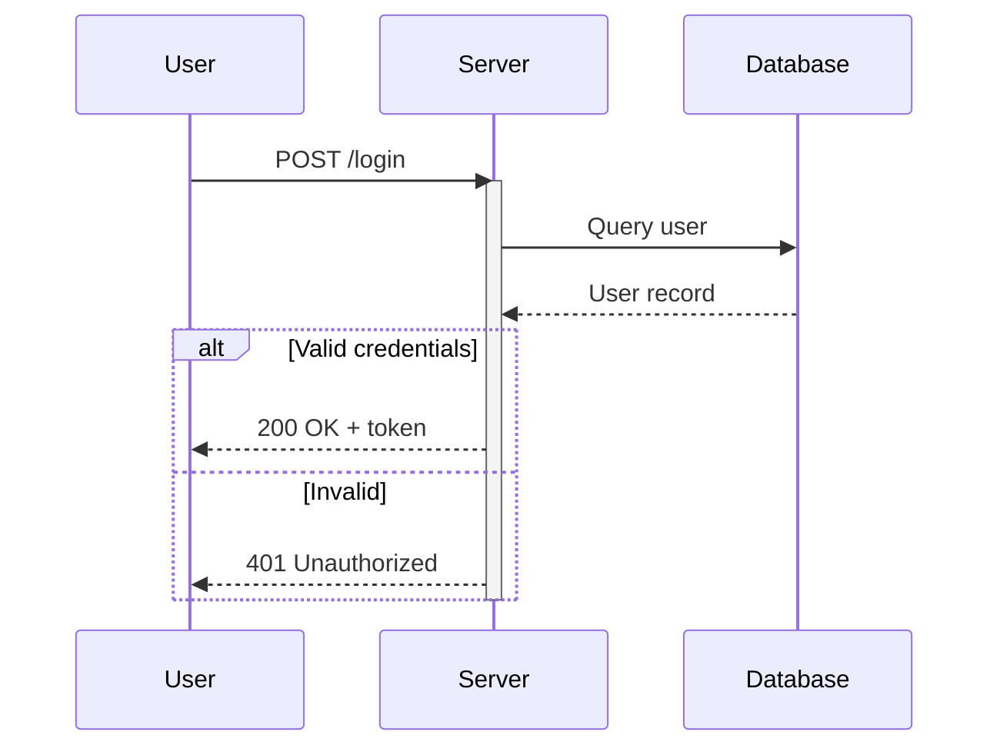

Arrow types:
- `->>` solid arrow (synchronous)
- `-->>` dashed arrow (response/async)
- `-x` solid with X (lost message)
- `-)` solid arrow (async, open)

Features: `activate`/`deactivate`, `alt`/`else`/`end`, `loop`/`end`, `opt`/`end`, `par`/`and`/`end`, `Note over A,B: text`

### Class Diagram

Use for object models, type hierarchies, API structures.

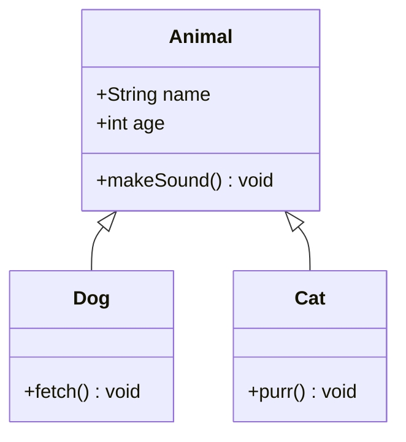

Relationships:
- `<|--` inheritance
- `*--` composition
- `o--` aggregation
- `-->` association
- `..>` dependency
- `<..` realization

### State Diagram

Use for state machines, lifecycle flows, status transitions.

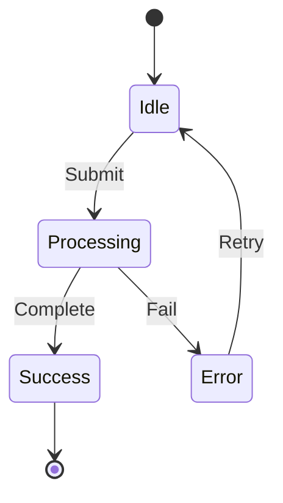

Features: `[*]` for start/end states, `state Fork <<fork>>`, composite states with `state Name { ... }`

### ER Diagram

Use for database schemas, data models, entity relationships.

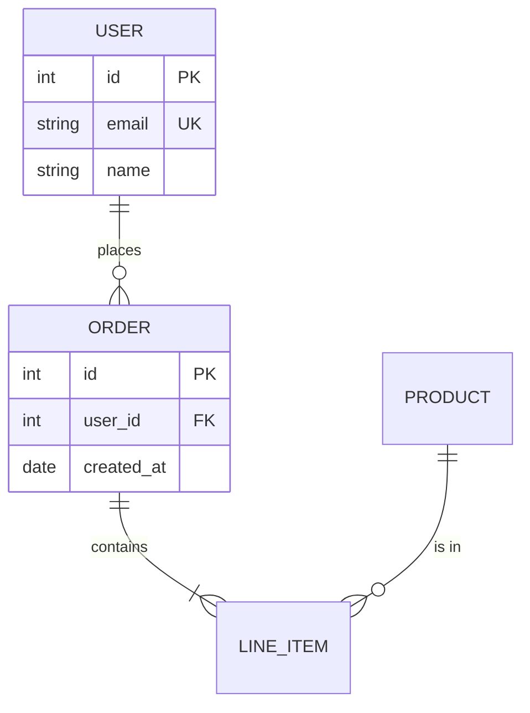

Cardinality: `||` exactly one, `o|` zero or one, `}|` one or more, `}o` zero or more

### Gantt Chart

Use for project timelines, sprint planning, task scheduling.

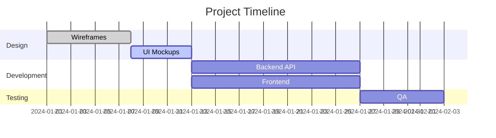

Task states: `done`, `active`, `crit` (critical path)

### Pie Chart

Use for proportions, distributions, simple breakdowns.

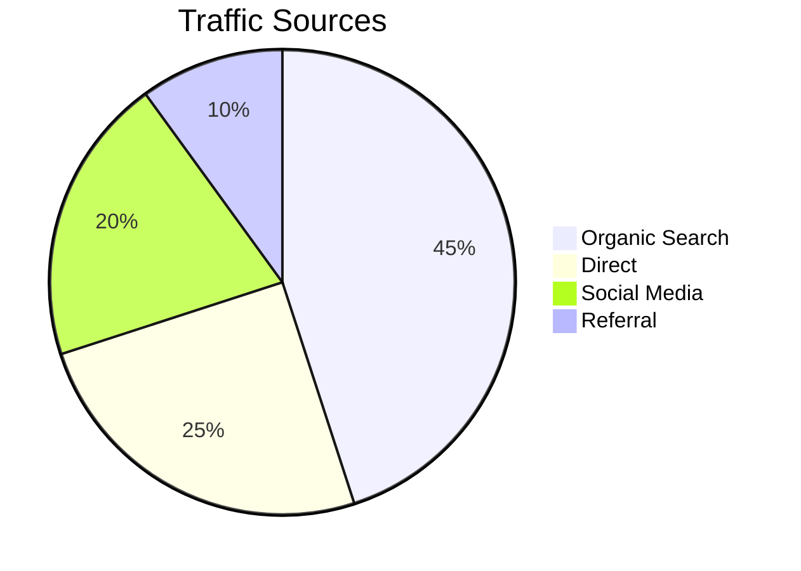

### Mindmap

Use for brainstorming, topic hierarchies, concept exploration.

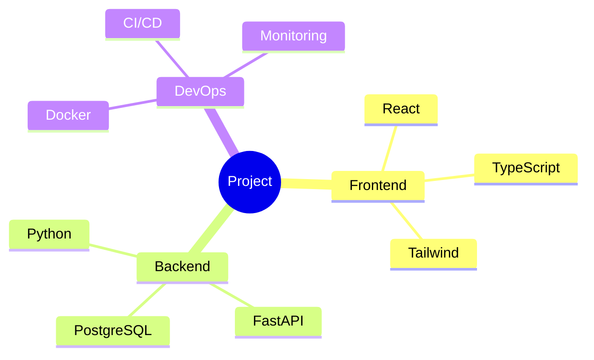

### Timeline

Use for chronological events, version history, milestones.

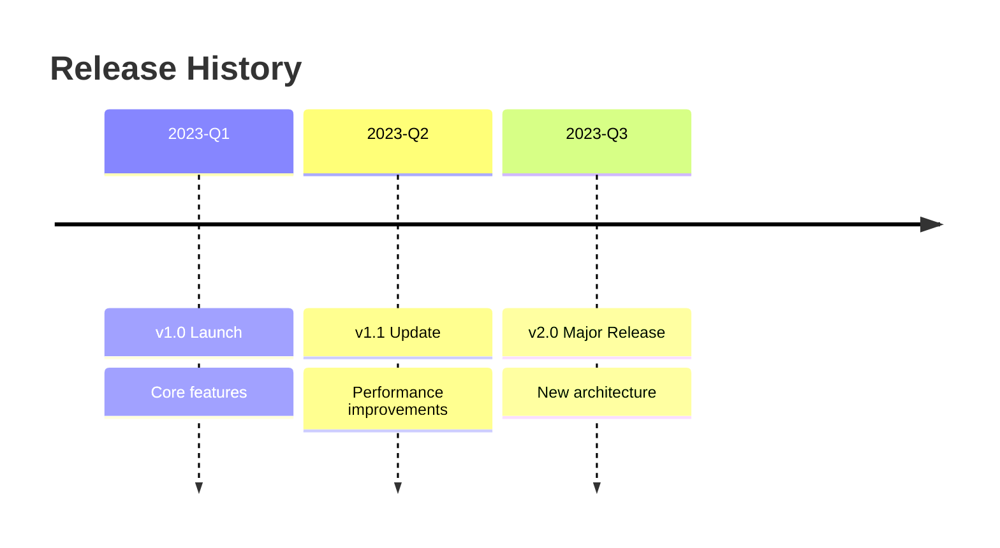

### Git Graph

Use for branching strategies, merge workflows, release flows.

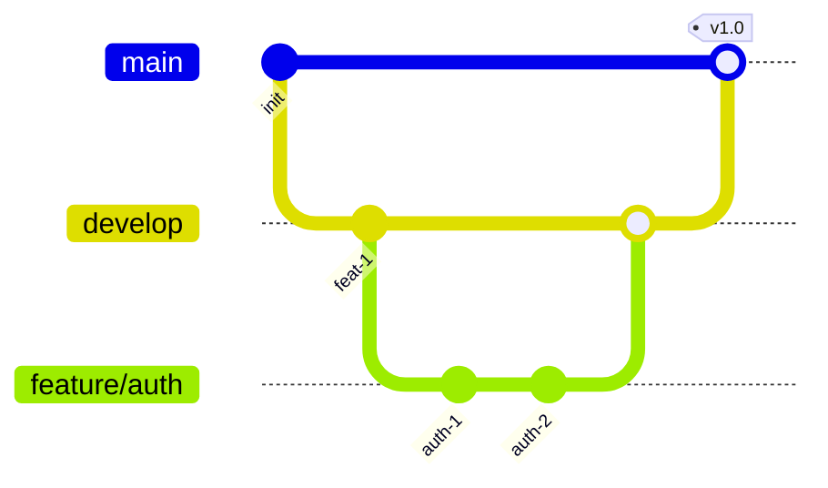

## Best Practices

1. **Keep it simple** — Limit nodes to 15-20 per diagram. Split complex systems into multiple diagrams.
2. **Label edges** — Always label arrows to explain the relationship or data flow.
3. **Use meaningful IDs** — Use descriptive node IDs (`AuthService` not `A1`).
4. **Choose direction wisely** — Use `TD` for hierarchies, `LR` for processes/timelines.
5. **Use subgraphs** — Group related nodes to improve readability.
6. **One concept per diagram** — Don't try to show everything at once.
7. **Test syntax** — Mermaid is whitespace-sensitive. Avoid special characters in labels without quotes.
8. **Quote labels with special chars** — Use `["Label with (parens)"]` for labels containing special characters.

## Common Pitfalls

- **Semicolons**: Not needed at end of lines
- **Special characters in labels**: Wrap in quotes `["my label: value"]`
- **Empty lines**: Avoid empty lines inside diagram blocks
- **Case sensitivity**: Keywords like `graph`, `subgraph`, `end` are case-insensitive but node IDs are case-sensitive
- **Duplicate IDs**: Each node ID must be unique within a diagram
